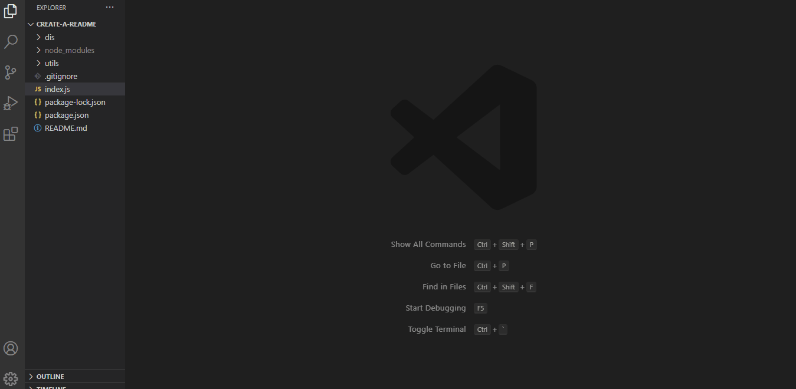

# README Generator!

## Description 
    The user can answer a series of prompts and will have a full README.md file created with their information.

## Licenses
    - MIT
    - Apache 2.0
    - GPL 3.0
    - BSD 3

## Installation
    To run this application run npm i in the command line, and use 'node index.js' to access the prompts. 

## Technologies 
    * javaScript
    * Nodejs
    * Inquirer

### Credits 
    * https://gist.github.com/lukas-h/2a5d00690736b4c3a7ba
    * Used to get the license URL for the final result